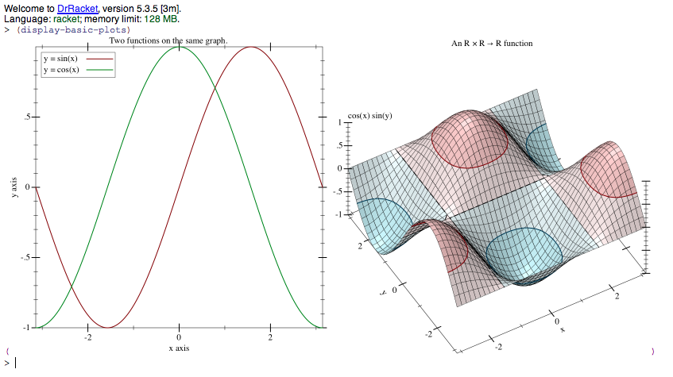
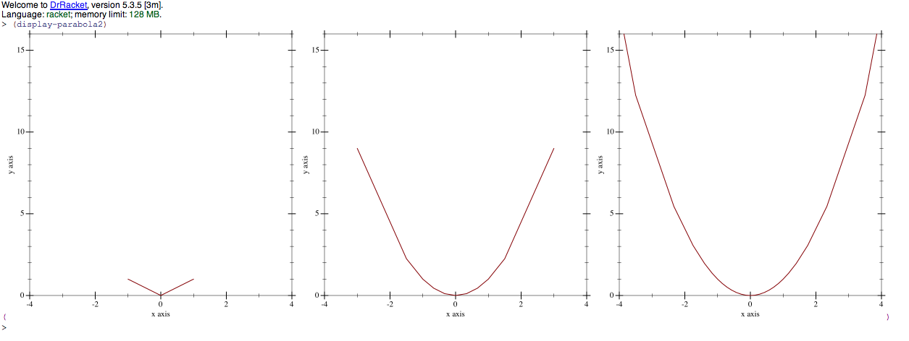
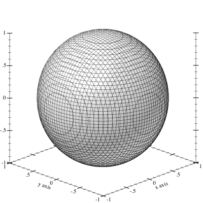
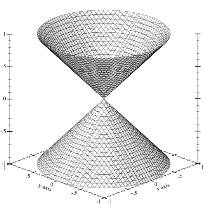
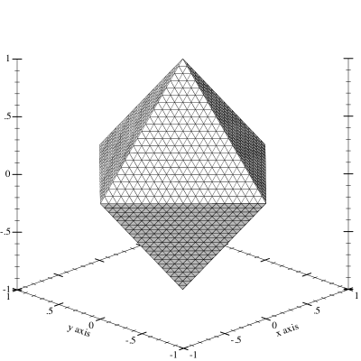
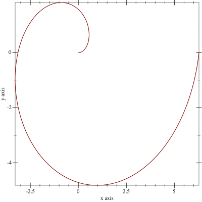

# Write your Report
Write your report right in this file. Instructions are below. Delete the instructions when you are done. Also delete all my explanation (this stuff), as I've already read it.

You are allowed to change/delete anything in this file to make it into your report. It will be public, FYI.

This file is formatted with the [**markdown** language][markdown], so take a glance at how that works.

This file IS your report for the assignment, including code and your story.

Code is super easy in markdown, which you can easily do inline `(require net/url)` or do in whole blocks:
```
#lang racket

(require net/url)

(define myurl (string->url "http://www.cs.uml.edu/"))
(define myport (get-pure-port myurl))
(display-pure-port myport)
```

# My Library: Plot
My name: Wesley Nuzzo

Racket's plot library is pretty obvious as to its purpose: plot things!
The library has a whole collection of "renderers" that represent such things as scatter plots, bar graphs, and plots of  functions. These renderers can then be passed to either the `(plot)` or `(plot3d)` function to display them. I'm going to experiment with creating simple geometric shapes using these renderers.

The very first thing I want to do with the library is to simply test that it works.
For 2d plots, I'll start by testing the ability to plot two functions at the same time. I'll choose the sine and cosine functions because they're related, and I'll make them different colors so that we can tell them apart.
For 3d plots, I'll just use the same plot used in the documentation. I'll go with the contours3d graph because that one looks slightly cooler.

I define the renderers like this:
```
;; 2D
(define sine (function sin (- pi) pi
                       #:label "y = sin(x)"))
(define cosine (function cos (- pi) pi
                         #:label "y = cos(x)" #:color 2))
;; 3D
(define 3d-surface
  (contour-intervals3d (λ (x y) (* (cos x) (sin y)))
                       (- pi) pi (- pi) pi))
```

To display them I then define this function:
```
;; plot and display
(define (display-basic-plots)
  (display (list (plot (list sine cosine)
                       #:title "Two functions on the same graph.")
                 (plot3d 3d-surface
                         #:title "An R × R → R function"
                         #:x-label "x" #:y-label "y" #:z-label "cos(x) sin(y)"))))
```
Calling this function displays a list of two graphs:

Both graphs can be interacted with: the 3d graph can be rotated and the 2d graph can be zoomed in and out.

## 2 dimensions

The simplest renderer is called `(function)`, and it simply plots the values of a single-argument function using cartesian coordinates.

I can create a circle using this renderer by doing the following:
```
;; circle
(define (circle radius)
  ;; One upper semicircle and one lower semicircle
  (list (function (λ (x) (sqrt (- radius (* x x))))
                  (- radius) radius
                  #:label "circle top")
        (function (λ (x) (- (sqrt (- radius (* x x)))))
                  #:label "circle bottom" #:color 2)))
```
This function takes a single argument, `radius`, and returns a list of two renderers. Passing this list as an argument to `(plot)` will cause it to display both functions on the same graph.
The first renderer plots the top half of the circle, and the second renderer plots the bottom half. To help tell the two apart, the functions are labeled and the second one is given a different color.

The output of `(plot (circle 1))` looks like this:
).png)

I can fill in the circle using the function-interval renderer, which plots two functions simultaneusly and also fills in the space between those two functions.
```
;; filled
(define (filled-circle radius)
  ;; simply the interval between the two semicircles
  (function-interval (λ (x) (sqrt (- radius (* x x))))
                     (λ (x) (- (sqrt (- radius (* x x)))))
                     -1 1))
```
The output of `(plot (filled-circle 1))` looks like this:
).png)


I can also create a square using a similar approach. (The library has a rectangle function for bar graphs, but that won't give me a rotated square.)
```
(define (rotated-square side-length)
  ;; multiply by (sqrt 2) for x-min and x-max
  ;; because of the pythagorean theorem / 45-45-90 triangles
  (let ((x-min (- (* side-length (sqrt 2))))
        (x-max (* side-length (sqrt 2))))
    ;; use absolute value function to get v-shape
    ;; we need one pointing up and one pointing down
    (list (function (λ (x) (- x-max (abs x))) 
                    x-min x-max)
          (function (λ (x) (- (abs x) x-max))
                    x-min x-max))))
```
Since I want the square to be rotated 45 degrees, I set the size of the horizontal axis to be `side-length` * sqrt(2). By the pythagorean theorem, this ensures that the square's side length will be what was passed in as `side-length`.
As with the circle, the square is plotted using two lines, but this time they are the same color.

The output of `(plot (rotated-square 1))` looks like:
).png)


### Polar Renderers

There's also a renderer called `(polar)`, which uses polar coordinates.
It's very easy to make a circle using this, but filling it in requires a bit of a trick:
```
(define (filled-polar-circle radius)
  ;; fill from the center of the circle, but make that "line" transparent
  ;; so there's no dot in the center of the circle
  (polar-interval (λ (θ) radius)
                  (λ (θ) 0)
                  #:line2-style 'transparent))
```
`(λ (θ) radius)` creates the outer circle, while `(λ (θ) 0)` is the center. Thus, the interval fills in the circle from the center to the circumerence. However, to avoid having a dot at the center of the circle, I make the line drawn by `(λ (θ) 0)` transparent.

The output of `(plot (filled-polar-circle 1))` is indistinguishible from the output of the `(function)` implementation:
).png)

We can also make a square:
```
(define (rotated-polar-square side-length)
  ;; when sidelength = 1,
  ;; |x| + |y| = sqrt(2), therefore
  ;; |r*cos| + |r*sin| = sqrt(2), therefore
  ;; r=sqrt(2) / (|cos|+|sin|)
  (polar (λ (θ) (/ (* side-length (sqrt 2)) (+ (abs (cos θ)) (abs (sin θ)))))))
```
The comments show the logic I followed to come up with this function.

The output of `(plot (rotated-polar-square 1))` is again indistinguishible from the previous version:
).png)


### Lines and Linear-Seq

The `(lines)` and `(linear-seq)` function are useful for "sampling" a function, rather than printing out a smooth curve. `(lines)` takes a list of points and connects them with straight lines, while linear-seq returns a specified number of evenly spaced numbers within a given range.
The library's documentation provides an example in which these two functions are combined to create a shape approximately equivalent to a parabola.
```
> (define xs (linear-seq -1 1 11))
> (plot (lines (map vector xs (map sqr xs))))
```
<!-- Markdown version creates an image that is absurdly large -->


Modifying this slightly, I can create a function that approximates a parabola with a number of samples specified by the caller:
```
;;; This function returns a shape that approximates a parabola.
;;; The higher n is, the more closely it approximates the correct shape.
(define (parabola1 n)
  (define xs (linear-seq -1 1 n))
  (lines (map vector xs (map sqr xs))))
```
Note that calling this function with an `n` less than 3 requires specifying `#:y-min` and `#:y-max` when plotting.

Modifying this further allows me to extend the approximation beyond the range of -1 to 1:
```
;; This extends the previous function to go beyond -1 to 1 on x axis
(define (parabola2 n)
  ;; note the (- (expt 2 n) 1) instead of just n
  (define inner-xs (linear-seq -1 1 (- (expt 2 n) 1)))
  
  ;; take the reciprocal of the inner-xs to get the outer-xs
  ;; note that this covers ground at an exponential rate
  (define outer-xs (map (λ (x) (/ x))
                       (filter (λ (x) (not (or (= x 0) (= x 1))))
                               inner-xs)))
  
  (define xs (sort (append inner-xs outer-xs)
                   <))
  (lines (map vector xs (map sqr xs))))
```
The core of the function is essentially the same, but this time it produces (2^`n`)-1 inner samples instead of just `n`, and in addition produces outer samples equal to the reciprocal of those inner samples. Note that this results in the graph having higher precision where |x|<1 than where |x|>1.

To test this, I'll create a new function:
```
(define (display-parabola2)
  (display (list (plot (parabola2 2)
                       #:x-min -4 #:x-max 4 #:y-min 0 #:y-max 16)
                 (plot (parabola2 3)
                       #:x-min -4 #:x-max 4 #:y-min 0 #:y-max 16)
                 (plot (parabola2 4)
                       #:x-min -4 #:x-max 4 #:y-min 0 #:y-max 16))))
```
Calling `(display-parabola2)` gives the following output:


## 3 dimensions

Spheres:
```
(define sphere-polar (polar3d (λ (θ ρ) 1)))
(define isosphere (isosurface3d
                   (λ (x y z) (sqrt (+ (sqr x) (sqr y) (sqr z)))) 1
                   -1 1 -1 1 -1 1))
```
The double-cone:
```
(define double-cone (isosurface3d
                     (λ (x y z) (- (sqr z) (sqr x) (sqr y))) 0
                     -1 1 -1 1 -1 1))
```
An octahedron:
```
(define octahedron (isosurface3d
                    (λ (x y z) (+ (abs x) (abs y) (abs z))) 1
                    -1 1 -1 1 -1 1))
```
What these look like depends on the viewing angle, but at (angle=45, altitude=20), they are:




## Miscelleneous

Here are a few other shapes I was able to create:

oval
```
(define oval
  (parametric (λ (t) (vector (sin (- 1 t)) (sin t)))
              0 (* 2 pi)))
```
.png)

spiral
```
(define spiral
  (polar (λ (θ) θ)))
```


I don't have a name for this one, so I'm just calling it a "bow-shape"
```
(define bow
  (let ((a (* 1/2 pi))
        (b (* 2/2 pi))
        (c (* 3/2 pi))
        (d (* 4/2 pi)))
        (polar (λ (θ)
                 (cond ((<= 0 θ a) a)
                       ((<= a θ b) b)
                       ((<= b θ c) a)
                       ((<= c θ d) b)
                       (else a)))
               0 (* 5/2 pi))))
```
.png)

I attempted to create a sphere the using the surface3d renderer, but it didn't quite work out:
```
(define sphere-cartesian (list
                          (surface3d (λ (x y) (sqrt (- 1 (sqr x) (sqr y))))
                                    -1 1 -1 1)
                          (surface3d (λ (x y) (- (sqrt (- 1 (sqr x) (sqr y)))))
                                    -1 1 -1 1)))
```
.png)

As you can see, the shape gets a bit deformed at z=0. This is because it's really two seperate functions, and they don't cross that plane.

<!--

Write what you did!
Remember that this report must include:

* a narrative of what you did
* highlights of code that you wrote, with explanation
* output from your code demonstrating what it produced
* at least one diagram or figure showing your work

The narrative itself should be no longer than 350 words. Yes, you need at least one image (output, diagrams). Images must be embedded into this md file. We should not have to click a link to see it. This is github, handling files is awesome and easy!

Code should be delivered in two ways:

1. Full files should be added to your version of this repository.
1. Key excerpts of your code should be copied into this .md file, formatted to look like code, and explained.

Ask questions publicly in the email group.
-->

## How to Prepare and Submit this assignment

1. To start, [**fork** this repository][forking]. 
  2. (This assignment is just one README.md file, so you can edit it right in github)
1. Modify the README.md file and [**commit**][ref-commit] changes to complete your report.
1. Add your racket file to the repository. 
1. Ensure your changes (report in md file, and added rkt file) are committed to your forked repository.
1. [Create a **pull request**][pull-request] on the original repository to turn in the assignment.

## Project Schedule
This is the first part of a larger project. The final project schedule is [here][schedule]

<!-- Links -->
[schedule]: https://github.com/oplS16projects/FP-Schedule
[markdown]: https://help.github.com/articles/markdown-basics/
[forking]: https://guides.github.com/activities/forking/
[ref-clone]: http://gitref.org/creating/#clone
[ref-commit]: http://gitref.org/basic/#commit
[ref-push]: http://gitref.org/remotes/#push
[pull-request]: https://help.github.com/articles/creating-a-pull-request
