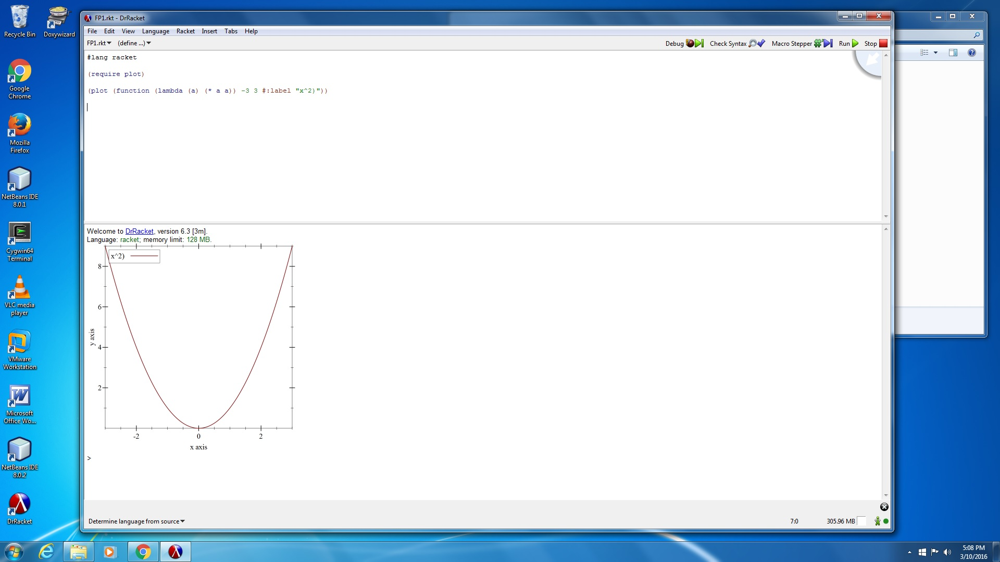
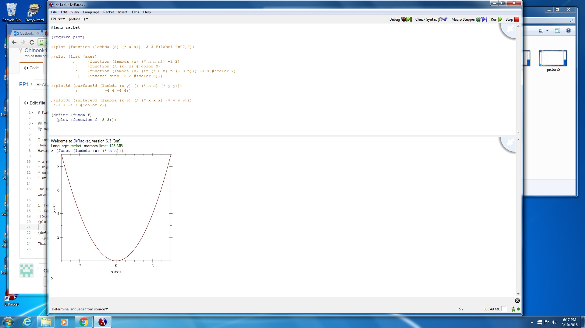
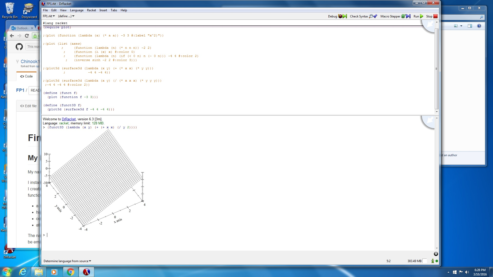

# Final Project Assignment 1: Exploration (FP1)

## My Library: Plot: Graph Plotting
My name: John Kuczynski. 

I installed the plot-gui-lib package, and then I used the functions in the library to draw a graph of a single function, x^2. 
Then, I created a graph with several functions. After that, I created several 3D graphs. 
Having accomplished that much, I created a function which accepted a 2D function, and would draw the graph of the function. Then, I created a function which accepted a 3d function, and would draw the graph of the function. 

* a narrative of what you did
* highlights of code that you wrote, with explanation
* output from your code demonstrating what it produced
* at least one diagram or figure showing your work

The narrative itself should be no longer than 350 words. Yes, you need at least one image (output, diagrams). Images must be embedded into this md file. We should not have to click a link to see it. This is github, handling files is awesome and easy!

1. Full files should be added to your version of this repository.
1. Key excerpts of your code should be copied into this .md file, formatted to look like code, and explained.

``` Racket
#lang racket
(plot (function (lambda (a) (* a a)) -3 3 #:label "x^2)"))
```


``` Racket
#lang racket
(define (funct f)
  (plot (function f -3 3)))
  ```
This code accepts a function which should have one parameter, and draws a graph of the function. The x coordinates are from -3 to 3.


```Racket
#lang racket
(define (funct3D f)
  (plot3d (surface3d f -4 4 -4 4)))
```
This code aceepts a function which should have 2 parameters, and draws a graph of the function. The x coordinates are from -4 to 4, and the y coordinates are from -4 4. 


