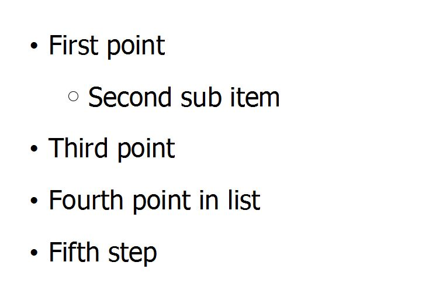

# Final Project Assignment 1: Exploration (FP1)

## My Library: (slideshow)
My name: Martin Rudzki

The reason I picked this library was to be able to present my project proposal to the class using racket library. I also have another project presentation in two weeks that I would like to use racket again for that. There is something cool about presenting a racket project using a racket library!

The first silde that comes up is a slow transtion of text welcoming people to the project. The second thing I was fooling around with was adding a picture. I then create a couple of geberic slide with the main heading staying the same as the slides go to a new page. The last thing I did with my slides was that every time you click it would bring down another bullet point.

#lang slideshow
(require slideshow/slides-to-picts
         slideshow/play)

;(play-n	 	gen*	 	 	 	 
; 	 [	#:steps steps	 	 	 	 
;; 	 	#:delay delay-secs	 	 	 	 
; 	 	#:skip-first? skip-first?	 	 	 	 
; 	 	#:skip-last? skip-last?	 	 	 	 
; 	 	#:title title	 	 	 	 
; 	 	#:name name	 	 	 	 
; 	 	#:layout layout])
(play-n
 (lambda (n1 n2)
   ;Below code will bring in the text slowly
   (cellophane (t "Hello and welcome to my project")
               (* n1 (- 1.0 n2)))))

(slide (item #:align 'right (bitmap  "awesome.jpg")))

;(item	 [	#:width width	 	 	 	 
; 	 	#:gap-size sep-gap-size	 	 	 	 
; 	 	#:bullet blt	 	 	 	 
; 	 	#:align align	 	 	 	 
; 	 	#:fill? fill?	 	 	 	 
; 	 	#:decode? decode?]	 	 	 	 
; 	 	element ...)	 	→	 	pict?
;Make a slide generic

(define (slide-n n z)
  (slide
   #:title "How to Generalize Slides"
   (item "This would be point number" (number->string n))
   (item "This would be point number" (number->string z))))
 
(slide-n 1 1.1)
(slide-n 2 2.2)
(slide-n 3 3.3)

;If an element is 'next, then a slide is generated containing only the preceding elements,
;and then the elements are re-processed without the 'next. Multiple 'next elements generate
;multiple slides.

;If an element is 'alts, then the next element must be a list of element lists. Each list
;up to the last one is appended to the elements before 'alts and the resulting list of
;elements is processed. The last lists is appended to the preceding elements along with
;the remaining elements (after the list of lists) and the result is re-processed.

;A 'nothing element is ignored (useful as a result of a branching expression).

;A 'next! element is like 'next, except that it is preserved when condensing
;(via the --condense flag).
(slide
 #:title "Example"
 (item "First point")
 'next
 (subitem "Second sub item")
 'next
 'alts
 ;list of items and you can insert the keyword next
 (list
  (list (item "Third point")'next
        (item "Fourth point in list")))
 'next
 (item "Fifth step"))

I thought the text fading in was pretty neat but my favorite code part would have to be the bullet points brought up with every click.
(slide ............

 (list
 
  (list (item "Third point")'next
  
   (item "Fourth point in list")))

What I liked most about it was creating a list of items and how simple and alegant the code looked. Compared to the following:

(slide................

 (item "First point")
 
  'next
  
  (subitem "Second sub item")
  
  'next

Output:

 
 
 

